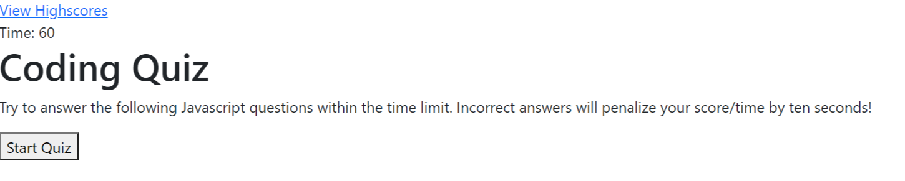

# 04 Code Quiz

## **Description**

This is a timed code quiz that cycles through 5 multiple choice questions about Javascript. 

Users click on the 'Start Quiz' button to begin. The timer starts and they are presented with the questions one by one. Incorrect answers subtract 10 seconds from the timer. After the last question they are given an input box to write their initials. They then hit the 'Submit' button to submit their initials and score. 

   

View Application: [Code Quiz](https://logan-bonnesen.github.io/03-Password-Generator)